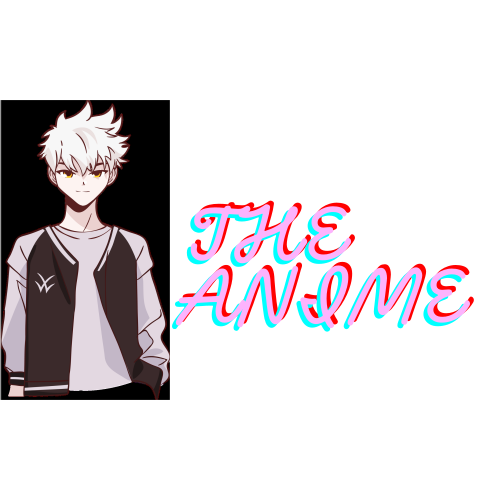

# The Anime

The Anime is a web application created using the Vite framework where users can explore anime characters and learn more about their favorite characters.

## Features

- Explore a wide range of anime characters.
- Detailed information about each character.
- Fast and responsive user interface.

## Framework

This project is built using the Vite framework, which provides a fast and optimized development environment.

## Getting Started

Follow these steps to set up and run the project locally:

### Prerequisites

- Node.js (version 14 or higher)
- npm (version 6 or higher) or yarn

### Installation

1. Clone the repository:
    ```sh
    git clone https://github.com/your-username/the-anime.git
    cd the-anime
    ```

2. Install the dependencies:
    ```sh
    npm install
    # or
    yarn install
    ```

### Running the Project

1. Start the development server:
    ```sh
    npm run dev
    # or
    yarn dev
    ```

2. Open your browser and navigate to `http://localhost:3000` to see the application in action.

## Available Scripts

- `npm run dev` or `yarn dev`: Starts the development server.
- `npm run build` or `yarn build`: Builds the project for production.
- `npm run serve` or `yarn serve`: Serves the production build locally.

## Learn More

- [Vite Documentation](https://vitejs.dev/guide/)
- [React Documentation](https://reactjs.org/docs/getting-started.html)

## License

This project is licensed under the MIT License.